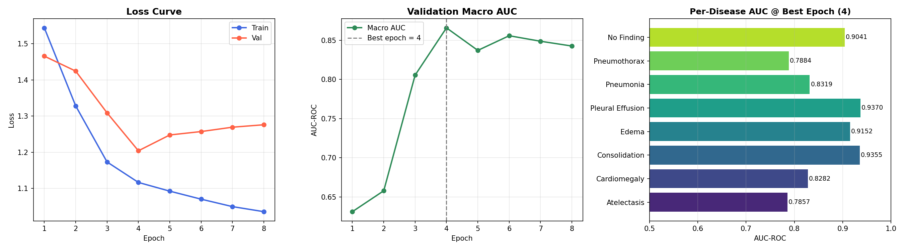
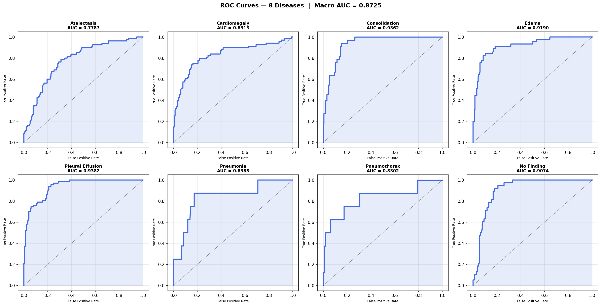
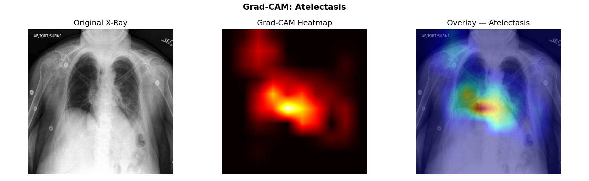
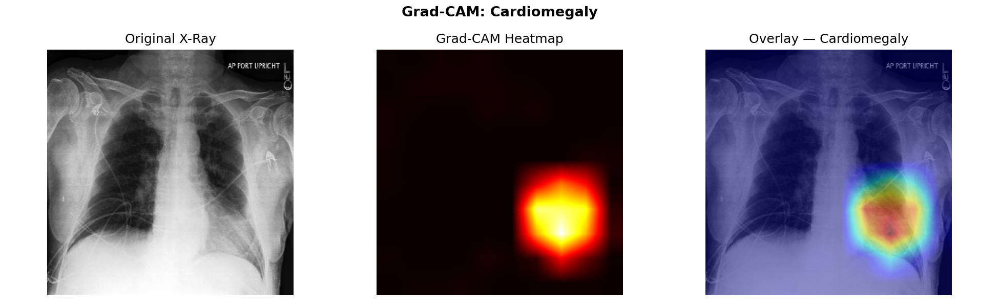
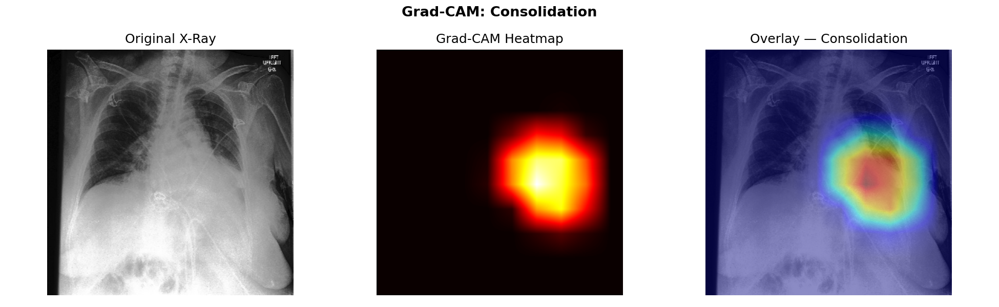
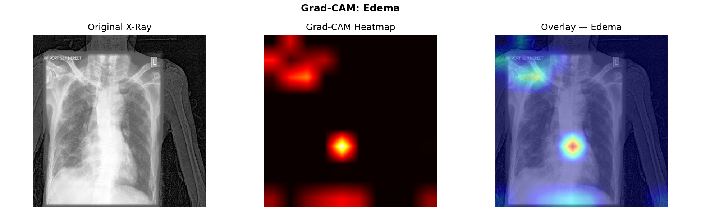
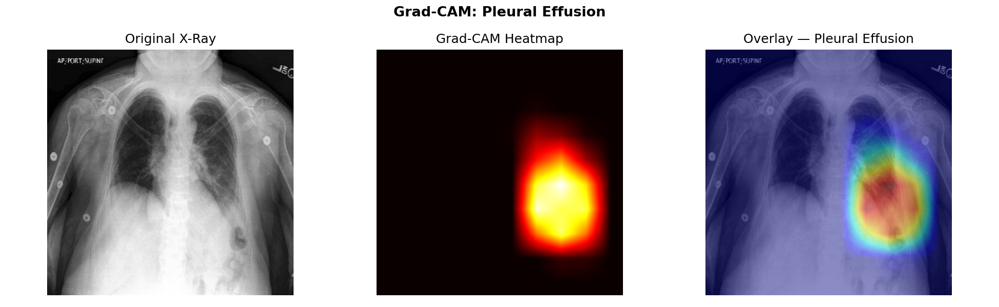
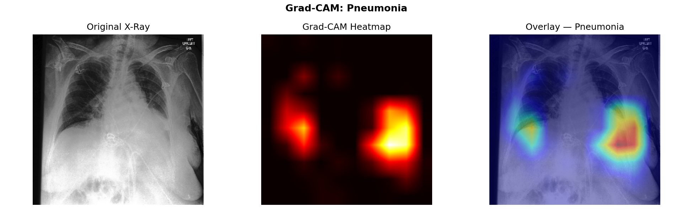
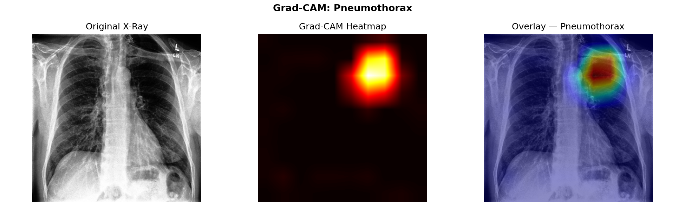
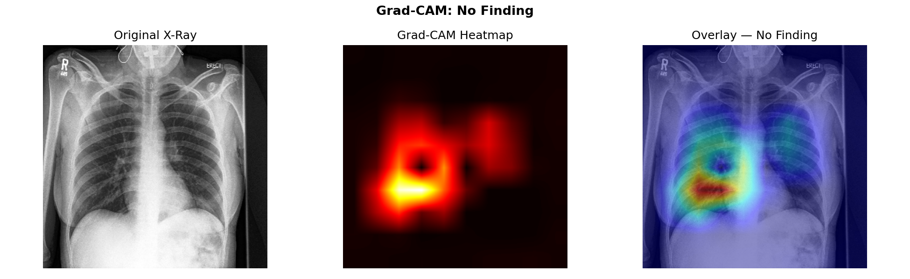

# 🩺 Chest X-Ray Disease Detection using Deep Learning

A deep learning system that detects **8 thoracic diseases** from chest X-ray images using **EfficientNetV2-M** and transfer learning.

The model is trained on the **CheXpert dataset** and uses modern deep learning techniques such as:

- Transfer learning
- Mixed precision training
- Class imbalance handling
- Test-Time Augmentation (TTA)
- Grad-CAM explainability

---

# 📌 Overview

Chest X-ray interpretation is a critical task in medical diagnostics.  
This project builds a **multi-label classification model** capable of predicting multiple thoracic diseases simultaneously.

The system analyzes an X-ray image and outputs probabilities for the following conditions:

| Disease |
|------|
| Atelectasis |
| Cardiomegaly |
| Consolidation |
| Edema |
| Pleural Effusion |
| Pneumonia |
| Pneumothorax |
| No Finding |

---

# 🧠 Model Architecture

The model uses **transfer learning** from EfficientNetV2-M.

### Architecture Components

- Backbone: **EfficientNetV2-M**
- Pooling: **GeM (Generalized Mean Pooling)**
- Custom classification head
- Multi-label sigmoid output

---

# ⚙️ Training Details

| Parameter | Value |
|------|------|
| Image Size | 320 × 320 |
| Batch Size | 32 |
| Epochs | 8 |
| Optimizer | AdamW |
| Scheduler | Cosine Warmup |
| Mixed Precision | Yes |
| Loss Function | Masked BCEWithLogits |
| Dataset | CheXpert |

Special techniques used:

- **Class imbalance weighting**
- **Uncertain label handling**
- **Backbone freezing during warmup**
- **Fine-tuning after warmup**

---

# 📊 Model Performance

### Best Validation Macro AUC

### Per-Disease AUC

| Disease | AUC |
|------|------|
| Atelectasis | 0.7857 |
| Cardiomegaly | 0.8282 |
| Consolidation | 0.9355 |
| Edema | 0.9152 |
| Pleural Effusion | 0.9370 |
| Pneumonia | 0.8319 |
| Pneumothorax | 0.7884 |
| No Finding | 0.9041 |

---

# 📈 Training Curves



---

# 📉 ROC Curves



---

# 🔬 Model Explainability (Grad-CAM)

Grad-CAM highlights the regions of the X-ray that influenced the model’s predictions.

| Disease | Visualization |
|------|------|
| Atelectasis |  |
| Cardiomegaly |  |
| Consolidation |  |
| Edema |  |
| Pleural Effusion |  |
| Pneumonia |  |
| Pneumothorax |  |
| No Finding |  |

---

# 📄 Output Files

### `validation_predictions.csv`

Contains predicted probabilities and binary predictions for each disease.


---

# 🚀 Running Inference

Example inference code:

```python
import torch
from PIL import Image
import torchvision.transforms as T

model = torch.load("model/best_model.pt")

transform = T.Compose([
    T.Resize((320,320)),
    T.ToTensor()
])

img = Image.open("xray.jpg").convert("RGB")
img = transform(img).unsqueeze(0)

with torch.no_grad():
    logits = model(img)
    probs = torch.sigmoid(logits)

print(probs)